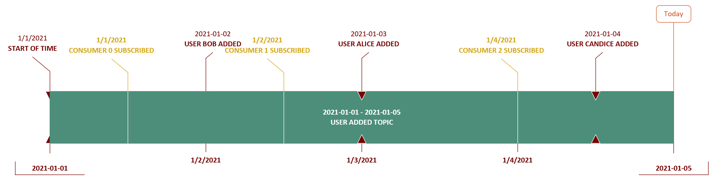

<div style="background: aliceblue"><h2>C# Advent</h2>This post is one among many which is part of 2021's [C# Advent](https://csadvent.christmas/). There are a ton of really great posts this year and some new bloggers to discover. I'd strongly encourage you to check it out.</div>
<hr/>

Years ago I was talking to somebody, and I'm sorry I don't recall who, that was bemoaning the lack of innovative data storage technologies in the .NET space. I honestly didn't have an answer to that. We have RavenDB but I would avoid that if I possibly could. In the Java space there was Neo4J, Voldemort, Elasticsearch, Cassandra... 

Fortunately, those of us who are ostensibly .NET developers don't have to rely on a data storage tool being written in the same language we're using to benefit from it. One of the technologies I've been looking at recently is Apache Kafka, which is another Java based data storage and routing tool. It is effectively a messaging system but Kafka adds persistence on top of that.

# So what is Kafka?

On the surface it sounds like Kafka is basically the same thing as Azure Service Bus and I agree there are strong similarities in some of the names and concepts. The difference between Kafka and another queuing system like RabbitMQ or Azure Service Bus is that Kafka allows for retaining messages for a set period of time independently of the consumers. Perhaps an example will help illustrate that. 

Here we have a time-line of events and consumers subscribing to a series of events. In this case we have all the events fired when a user is added. 



If this topic was an ASB topic then the messages received by the subscribers would be 

```
Consumer 0 -> Bob Added, Alice Added, Candice Added
Consumer 1 -> Alice Added, Candice Added
Consumer 2 -> Candice Added
```

A consumer will only get messages which were published after the consumer subscribed. However if this was a Kafka topic then the consumers would get 

```
Consumer 0 -> Bob Added, Alice Added, Candice Added
Consumer 1 -> Bob Added, Alice Added, Candice Added
Consumer 2 -> Bob Added, Alice Added, Candice Added
```

The consumer would get messages from the start of the stream, or at least the start of the retention period, on. Why would you want that? Well if you were trying to build a system that built read models based on the event stream you'd be able to replay it from the start of time and get an accurate model at any point in the future. 

This is perhaps not quite the exact same thing as Event Sourcing depending on your definition but it at the very least Event Sourcing adjacent. I cannot tell you the number of times over the years that I've run into production issues where having a complete event log would have made my life easier. "Simon, who deleted this user?" "Simon, when did we make this change to accounts?" or, worst of all "How come this data has value `A` and not `B`?"

# Partitions and Topics 

Kafka is designed to be used in very busy environments with bucket loads of messages going around the system every day. This is more than can be handled by any single server even in this day of very powerful servers. So you can fragment a topic into a number of partitions and each partition can be hosted on a separate server. Kafka handles the complexities of distributing the messages between the partitions. Setting a replication factor will determine how many nodes end up with the message copied to them. In most production systems you'll want this to be > 1 so that you run less of a risk of losing a message. Kafka can handle the selection of a partition for you or you can generate a partition key for your messages on your own if you believe you know better what the distribution of messages will look like. Keep in mind that changing the number of partitions when you're doing your own partition selecting will probably require changes to your code. This feels to me like it is leaking a deployment topology concern into your application code. 


I've kind of glossed over any mention of Zookeeper here. Zookeeper is a technology which is used by a number of different distributed data storage systems and helps out with things like leader elections, distributed configuration and liveness checking. GitHub copilot wants me to say that "It's not a technology that you need to know about to use Kafka." I think that's too strong of a statement. You should at least know that it is part of the mix and know that if you're configuring your own cluster you'll need to be aware of the failover semantics related to Zookeeper.