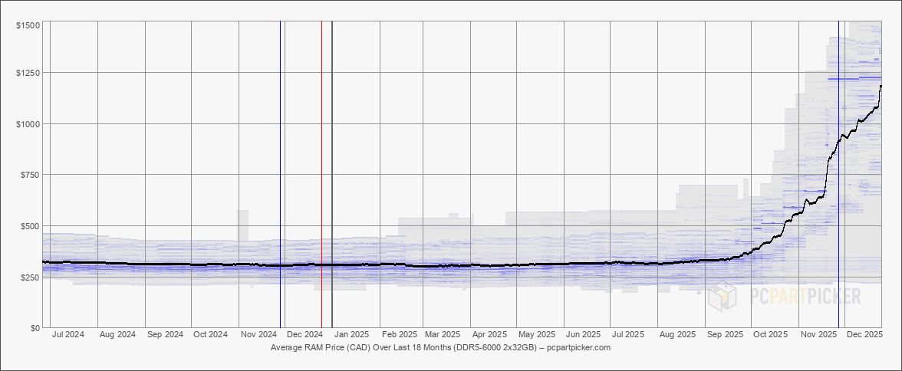

There is so much money tied up in AI these days that it seems impossible that all these AI comapnies are going to survive. Eventually the venture capital money is going to dry up and who is going to be left holding the bag?

At the same time the progress on models seems to be slowing down. When I use Cursor I've got a varierty of different models to pick from and I don't see a super meaningful difference between them. Perhaps I'm just oblivious but they're all pretty spectacular. And that's part of the problem, changing models comes at almost zero cost. So today I can use Gemini and tomorrow GTP-5 so what moat do these companies have other than capacity? Even if I've got an applicaiton that is using an AI API then switching to a different provider is trivial.

Meanwhile running models locally is getting easier. Sure they're not as good as the big models but for many applications they're good enough. And running locally means no ongoing costs, no API limits and no data privacy issues. If you're a small or medium business then buying a few GPUs to act as a farm for employeees to use is a one time cost that might make more sense than paying for API calls forever.

I honestly belive that the future is going to be a hybrid approach: some operations will run on local models and then fewer will be farmed out to a larger cloud model. But the number of application which make sense to run on a cloud model is going to be fewer and fewer as local models get better and better. Summarizing emails, writing cover letters, cleaning up data and reports are all things that can be done with small models. So that's going to really undercut the market for OpenAI and others.

But here is where things get a little interesting: I was reading that OpenAI is purchasing [something like 40%](https://globalcio.com/news/16062/) of all the memory being produced by 2030. And that's just one company, if Microsoft, Google, Amazon and Meta all jump on this bandwagon then what memory will there be left for everyone else? What if that's the intention? We're already seeing consumer memory prices spike. 

Here are the average prices for DDR5-6000 2x32GB kits over the last 18 months (from PC PartPicker):

That seems like a hockey stick graph to me. And this memory is used in everything from desktops to laptops to phones to TVs. I best stupid toasters and fridges use memory now too. I'm remminded that during COVID a lot of tech companies were hiring anybody they could, not because they had work for them, but because they wanted to hoard talent and keep it away from competitors. What if the same is happening with memory and compute? What if these big AI companies are buying up all the resources they can get their hands on to keep it away from competitors and startups? And perhaps they're buying them to keep them out of the hand of consumers so they cannot run models locally?

That seems like a terrible thing for everybody. This strategy, if it is indeed a strategy and not a wild conspiracy theory, is going to cost billions. And just how long is venture capital going to pay for hording resources? At some point these companies are going to have to make money. And if they're spending all their money on hoarding resources then there won't be anything left for R&D, marketing or sales.